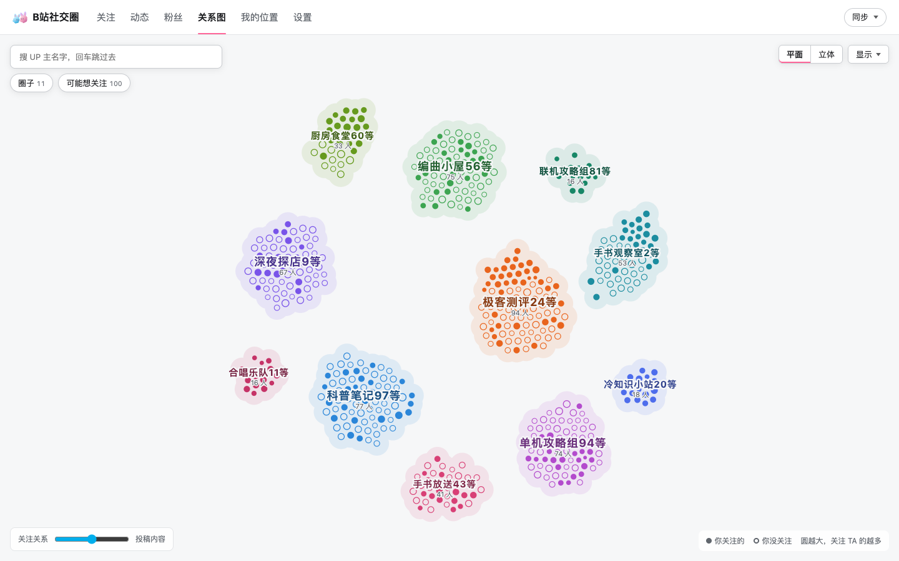
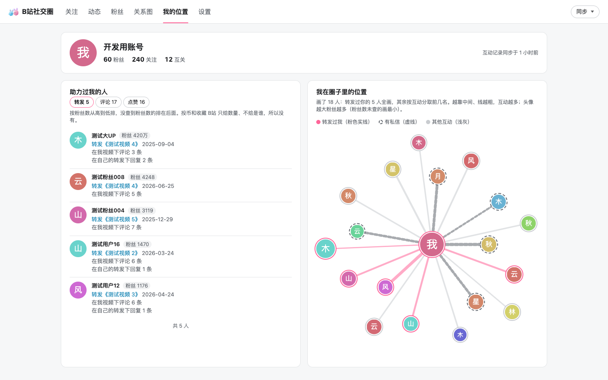
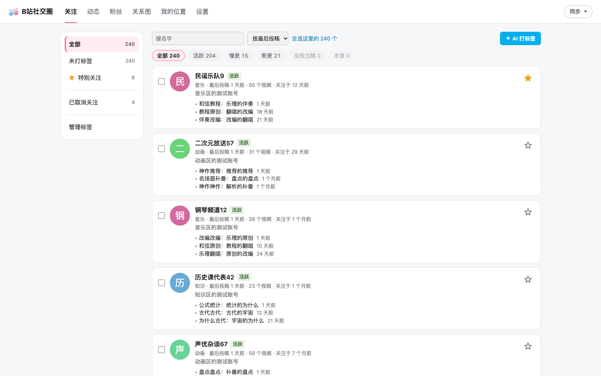

# B站社交圈 (BiliSocial)

一个 Chrome 扩展，用你自己的 B站 登录，看清你在 B站 的社交圈：你关注的人之间是什么关系，谁在给你转发和评论，你和谁私信最多。数据只存在你自己的浏览器里。

下面的截图全部是开发用的假数据。

## 页面

- **关注**：你关注的 UP 主。打标签（可以让 AI 批量打），看谁还在更新、谁慢更、谁断更，按关注时间或最后投稿排序，特别关注，取消关注和重新关注。
- **动态**：关注的人的新视频，可以按标签筛选，在页面里直接播放。B站 页面上 UP 主名字旁边也会显示你给 TA 打的标签。
- **粉丝**：粉丝列表，谁和你互关，谁是新粉丝，最近谁取关了你。可以回关。
- **关系图**：按「关注了谁」和「投了什么稿」把你关注的人画成一张图，相近的人聚成圈子，同一圈子同一个颜色。有平面和立体两种视图。可以以某个人为中心看和 TA 最像的人，也会列出你还没关注、但你的圈子都在关注的人。
- **我的位置**：你在中间，和你互动多的人连线到你，线越粗互动越多，有私信的用虚线。旁边列出助力过你的人，分转发、评论、点赞三栏，按对方粉丝数排序。
- **设置**：AI 接口、慢更和断更的天数、关系图里关注关系和投稿内容各占多少、新视频推送。

## 安装

还没有上架商店，需要手动加载。Chrome 和 Edge 都可以。

1. 下载或 clone 这个仓库。
2. 打开 `chrome://extensions`（Edge 是 `edge://extensions`）。
3. 打开「开发者模式」。
4. 点「加载已解压的扩展程序」，选仓库里的 `extension` 文件夹。
5. 在同一个浏览器里登录 B站，然后点工具栏上的扩展图标。

第一次用，点右上角「同步」，依次跑：

1. 「我的关注和粉丝」：一两分钟。
2. 「投稿内容」和「关注的关注」：和你关注的人数成正比，一千个关注大约各要半小时到一小时。
3. 「互动记录」：几分钟。

扩展大约每秒发 1 个请求。被 B站 限流时会自动暂停再继续。中途关掉浏览器也没关系，下次接着跑。以后点「更新」只查有变化的部分，快很多。

## 权限

| 权限 | 用来做什么 |
|---|---|
| `bilibili.com`、`api.bilibili.com`、`api.vc.bilibili.com` 等 B站 域名 | 用你的登录读关注、粉丝、投稿、评论、转发、通知和私信会话列表 |
| `hdslb.com` | 显示头像和视频封面 |
| `cookies` | 读 B站 的 `bili_jct`，只在你点关注、取关、特别关注时作为 csrf 参数发给 B站 |
| `storage`、`unlimitedStorage` | 把同步下来的数据存在本机 |
| `alarms` | 长时间同步时保持后台运行，定时检查新视频 |
| `scripting` | 安装或更新后，把标签显示脚本注入已经打开的 B站 页面 |
| `notifications`（可选） | 打开新视频推送时才会请求 |
| 任意网站（可选） | 只在你填写 AI 接口地址并保存时，请求访问那一个地址 |

## 隐私

- 所有数据都存在浏览器的 `chrome.storage.local` 里，不上传到任何服务器。这个项目没有服务器。
- 扩展只和 B站 通信，用的是你自己在浏览器里的登录。
- 唯一的例外是 AI：如果你在设置里填了 AI 接口（任何 OpenAI 兼容的接口），打标签和给圈子起名时，会把 UP 主的名字、简介和最近的视频标题发给你填的那个接口。不填就不会发。
- 私信只统计条数和时间。扩展要拉取私信记录才能数条数，但消息内容在拿到时就丢掉，不保存。
- 不会替你发私信。除了「特别关注」开关，不会改你在 B站 的关注分组。关注、取关、回关都要你点确认才会发出去。标签只存在扩展里。

## 已知限制

- 别人的关注列表 B站 只给最新的 100 个。超出的部分，扩展用「共同关注」补回其中你也关注的人，所以你关注的人之间的连线是全的，但第二层（你没关注的人）不全。
- 很多人隐藏了自己的关注列表（实测大约一半）。这些人在关系图里只能按投稿内容算远近。
- B站 有限流。同步大量数据时会被暂停，需要等一会儿。请求速度是固定的，没有办法加快。
- B站 的通知不全，所以「互动记录」会逐个扫你视频的评论区和转发，视频多的人第一次会慢一些。
- 立体视图需要 WebGL。

## 和 MoonDigest 的关系

[MoonDigest](https://github.com/PathGao/MoonDigest) 是同一个作者的姊妹项目，用 AI 读视频、整理收藏夹。这里的「关注」（给 UP 主打标签）和「动态」两个页面，MoonDigest 的分拣台里也有一份。两个扩展独立安装、数据不共享。

## 开发

不需要构建，没有运行时依赖。

- 自测：`for f in extension/*.selftest.js extension/*/*.selftest.js; do node "$f"; done`
- 假数据开发页：先跑 `node extension/dev/make-fixtures.mjs`，在仓库根目录跑 `python3 -m http.server 8700`，打开 `http://localhost:8700/extension/dev/index.html`。假数据全部是生成的，写在 `dev-fixtures/`（不进 git）。
- 代码结构和存储格式见 [DESIGN.md](DESIGN.md)。

## 许可证

[GPL-3.0](LICENSE)

## English

BiliSocial is a Chrome/Edge extension that maps your own Bilibili social circle using your existing login: a relationship graph of the accounts you follow (2D and 3D, clustered by who they follow and what they post), your fans, who reposts, comments on and likes your videos, and how much you message each contact (message counts and times only; message text is dropped as soon as it is fetched). It also lets you tag the UPs you follow and browse their new videos by tag. All data stays in `chrome.storage.local`. It talks only to Bilibili, plus an OpenAI-compatible endpoint if you configure one for AI tagging. There is no server. Install by loading the `extension` folder unpacked. The UI is in Simplified Chinese. Licensed under GPL-3.0.
